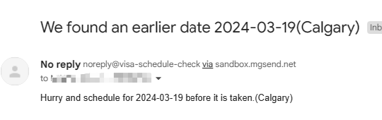

# USVisa Appointment Rescheduler

This is just a script I put together to check and notify me via email ([MailGun](https://www.mailgun.com/)) when there's an earlier date before my initial appointment date. . 

## How it works

* register some new account  
* Logs you into the portal
* checks for schedules by day 
* If there's a date before your initial appointment, it notifies you via email and automatically rechedule

> see `config.js` or `.env.example` for values you can configure

## Configuration

copy the example configuration file exampe in `.env.example`, rename the copied version to `.env` and replace the values.

### MailGun config values 

You can create a free account with https://www.mailgun.com/ which should be sufficient and use the provided sandbox domain on your dashboard. The `MAILGUN_API_KEY` can be found in your Mailgun dashboard, it starts with `key-xxxxxx`. You'll need to add authorised recipients to your sandbox domain for free accounts

## FAQ

* How do I get my facility ID - https://github.com/theoomoregbee/US-visa-appointment-notifier/issues/3
* How do I get my schedule ID - https://github.com/theoomoregbee/US-visa-appointment-notifier/issues/8, https://github.com/theoomoregbee/US-visa-appointment-notifier/issues/7#issuecomment-1372565292
* How to setup Mailgun Authorised recipients - https://github.com/theoomoregbee/US-visa-appointment-notifier/issues/5

## How to use it

* clone the repo 
* run `yarn install` within the cloned repo directory
* start the process with `node visa.js`

